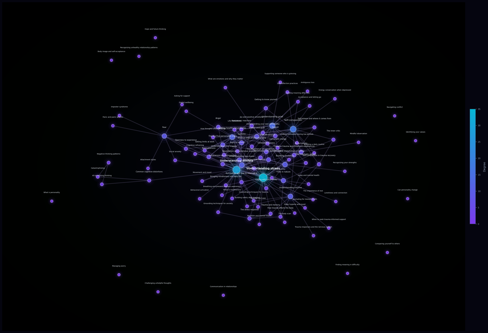

# egon-content

[](https://github.com/Egon-Notebooks/egon-content/actions/workflows/tests.yml)
[](https://github.com/astral-sh/ruff)
[](https://www.python.org/downloads/)

A command-line tool for mental health professionals to generate and curate educational articles as Markdown files, formatted for [Logseq](https://logseq.com) or [Obsidian](https://obsidian.md).

This is an early-stage project.
For now, content is generated by Claude and should still be reviewed before publication.
This repository generates general content, and will never contain any personal information.
All content is hosted on [Egon Notebooks](egonnotebooks.com).

## Getting started

### Prerequisites

- [uv](https://docs.astral.sh/uv/) — Python package and environment manager
- An [Anthropic API key](https://console.anthropic.com) — for article text generation
- An [OpenAI API key](https://platform.openai.com/api-keys) — for image generation (optional, use `--no-image` to skip)

Install `uv` if you don't have it:

```bash
curl -LsSf https://astral.sh/uv/install.sh | sh
```

### Installation

Clone the repository and install dependencies:

```bash
git clone <repo-url>
cd egon-content
uv sync
```

### Configuration

Copy the example environment file and add your API keys:

```bash
cp .env.example .env
```

Open `.env` and fill in your keys:

```dotenv
ANTHROPIC_API_KEY=your-anthropic-key-here
OPENAI_API_KEY=your-openai-key-here   # only needed for image generation
```

### Usage

**Generate a single article (with image by default):**

```bash
uv run egon generate --app logseq --topic "Managing social anxiety"
```

Output files are written to `generated_content/<app>/nodes/`, named after the topic title (e.g. `Managing social anxiety.md`).
Images are saved to `generated_content/<app>/images/`.
If a file already exists, you will be prompted whether to overwrite it.

**Generate without an image:**

```bash
uv run egon generate --app obsidian --topic "Joy" --no-image
```

**Generate a single pack (collection of articles):**

```bash
uv run egon pack --app obsidian --pack anxiety-and-worry
```

**Generate the full base collection (all base collection packs):**

```bash
uv run egon generate-all --app logseq --no-image
```

**Preview what would be generated without making API calls (dry run option):**

```bash
uv run egon generate-all --app obsidian --dry-run
uv run egon pack --app obsidian --pack anxiety-and-worry --dry-run
```

**Analyze the node graph of the base collection:**

```bash
uv run egon graph-report --app obsidian
```

This prints a structural overview and saves three files under `generated_content/<app>/`:

| File | Contents |
| --- | --- |
| `graph-report.txt` | Numeric metrics summary |
| `graph-data.txt` | Full adjacency list sorted by degree |
| `graph-plot.png` | Network visualization |

### Graph metrics

| Metric | What it measures | Mental health interpretation |
| --- | --- | --- |
| **Nodes** | Total articles | Size of the knowledge base |
| **Edges** | Undirected wikilink connections | Total concept relationships |
| **Avg degree** | Average connections per node | How well-linked topics are on average |
| **Density** | Edges as a fraction of all possible edges | How comprehensively the topic space is cross-linked |
| **Clustering coefficient** | How often a node's neighbors are also connected to each other | Reveals tight symptom/concept clusters (e.g. anxiety, worry, catastrophizing likely cluster together, which is clinically meaningful) |
| **Connected components** | Number of disconnected sub-graphs | A value > 1 means some topic areas are unreachable by wikilink navigation — a gap to address |
| **Orphan nodes** | Nodes with no connections | Articles that exist in isolation and won't be discovered by following links |
| **Most linked (top 10)** | Nodes with highest undirected degree | The anchor concepts of the knowledge base — most referenced, most visited |
| **Betweenness centrality (top 5)** | How often a node lies on the shortest path between two others | Bridge concepts — topics that connect different clusters (e.g. *Emotion regulation* may bridge anxiety and depression clusters). These articles are load-bearing: removing them fragments the graph |

The graph is a **directed simple graph** (DiGraph) — edges reflect wikilinks written into article bodies.
Metrics are computed on the undirected projection.
Edges are unweighted; self-loops are excluded.



**Install clinically validated questionnaire templates:**

```bash
uv run egon install-questionnaires --app obsidian
uv run egon install-questionnaires --app logseq
```

Writes one Markdown template per questionnaire to `generated_content/<app>/nodes/`.
No API call is made — content is exact and static.
Existing files are left untouched.

The following instruments are included (all open-license):

| Instrument | Full name | Measures |
| --- | --- | --- |
| PHQ-9 | Patient Health Questionnaire-9 | Depression |
| GAD-7 | Generalized Anxiety Disorder-7 | Generalized anxiety |
| WHO-5 | WHO Five Well-Being Index | Subjective wellbeing |
| PSS-10 | Perceived Stress Scale | Perceived stress |
| RSES | Rosenberg Self-Esteem Scale | Global self-esteem |
| BRS | Brief Resilience Scale | Resilience |

Each template is formatted for use as a monthly journal entry — questions are listed with response options and a score field, followed by a scoring guide and interpretation table.

**List all available packs and topics:**

```bash
uv run egon list-packs
```

---

## What gets generated

Each node is a Markdown file containing:

- **Metadata** — author, date, tags, and aliases in the format native to each app
- **Article body** — ~300 words of accessible, evidence-informed prose written in American English, following AFSP and SAMHSA safe messaging guidelines
- **Inline wikilinks** — topic titles and their aliases found in the body text are automatically wrapped in `[[...]]`, so the graph is connected out of the box
- **Illustration** — a 1200×675 WebP image generated by DALL-E 3 in a soft watercolor style (skippable with `--no-image`)
- **Disclaimer** — noting that the content has not yet been reviewed by a human expert

### Customizing prompts

- Edit `prompts/article_system.txt` to change the writing style or safe messaging instructions
- Edit `prompts/image_style.txt` to change the illustration style

### Adding packs or topics

Open `egon/packs.py` and add a new pack key with a list of topic strings, or append topics to an existing pack.
Run `uv run egon generate-all` to generate the new content.

### Adding aliases

Open `egon/linker.py` and add entries to the `TOPIC_ALIASES` dictionary.
Aliases appear in the node's metadata and are also matched when injecting wikilinks into body text.

---

## Reviewing generated content

### Logseq

1. Generate files with `--app logseq`
2. Copy `.md` files from `generated_content/logseq/nodes/` into the `pages/` folder of your Logseq graph
3. Copy images from `generated_content/logseq/assets/` into the `assets/` folder of your graph
4. Logseq detects both immediately — no import step needed
5. Open each page to review and edit before publishing

### Obsidian

1. Generate files with `--app obsidian`
2. Copy `.md` files from `generated_content/obsidian/nodes/` into your Obsidian vault
3. Copy images from `generated_content/obsidian/images/` into the same vault folder
4. Obsidian detects the files immediately — no import step needed
5. Open each note to review and edit before publishing

---

## Project structure

```text
egon/
├── cli.py                      # CLI entry point (generate, pack, generate-all, graph-report,
│                               #   install-questionnaires, list-packs)
├── packs.py                    # Topic pack definitions (BASE_PACKS controls the base graph)
├── prompts.py                  # Prompt loading and response parsing
├── linker.py                   # Inline wikilink injection and alias definitions
├── graph.py                    # Node graph analysis, metrics, and visualization
├── image_generator.py          # DALL-E 3 image generation
├── questionnaire_data.py       # Structured definitions for all validated questionnaires
├── questionnaire_formatter.py  # Renders questionnaire data to Obsidian / Logseq Markdown
└── generators/
    ├── __init__.py             # Shared filename utility
    ├── obsidian.py             # Obsidian Markdown formatter
    └── logseq.py               # Logseq Markdown formatter

prompts/
├── article_system.txt          # Claude system prompt (edit to change writing style)
└── image_style.txt             # DALL-E image style instructions (edit to change illustration style)

tests/
├── test_cli.py
├── test_generators.py
├── test_graph.py
├── test_image_generator.py
└── test_questionnaires.py
```

---

## Roadmap

The current focus is Logseq and Obsidian.
Once the concept is proven, the following may be added:

### Additional app targets

- **Zettlr** — academic/research focus, Zettelkasten methodology, Pandoc export
- **Dendron** — Markdown-based, lives inside VS Code as an extension
- **SiYuan** — block-based like Logseq, self-hostable
- **Anytype** — local-first, peer-to-peer architecture
- **Reflect**

### Next steps

- Include templates for journaling options (e.g. prompting a reflection question)
- Include self-assessment nodes (e.g. dimensional mood/anxiety scales)
